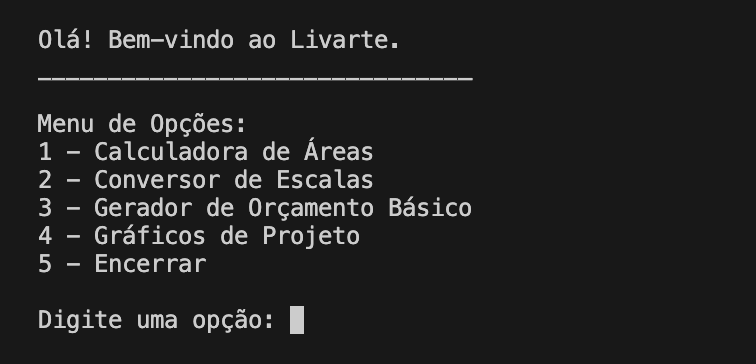
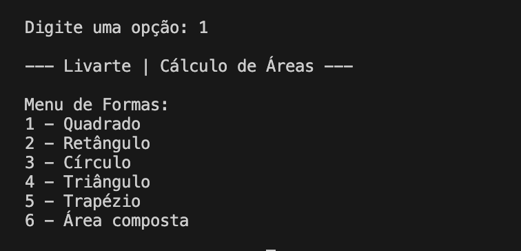
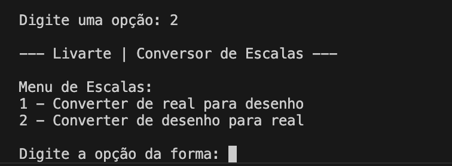
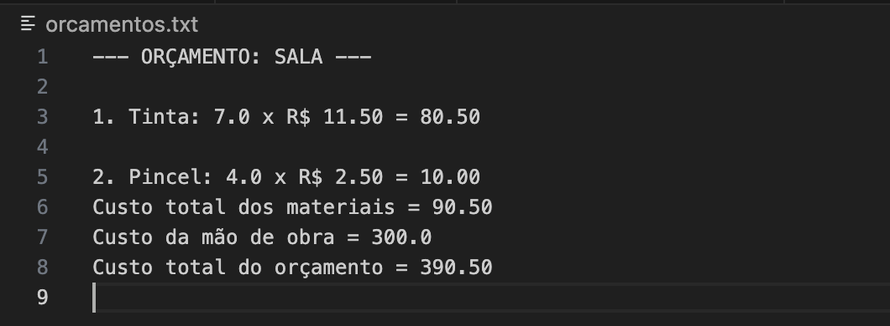

# LIVARTE 🏛️

O Livarte é uma aplicação em Python desenvolvida para **auxiliar e automatizar tarefas básicas** de profissionais das áreas de arquitetura e
design de interiores, além de atender pessoas que estão reformando suas casas. A ferramenta oferece uma maneira *prática e acessível* de
organizar custos e planejar **orçamentos**. Com ela, é possível **calcular áreas, converter escalas e construir gráficos** que facilitam
desenvolvimento do projeto. Os dados dos orçamentos são armazenados em um arquivo *.txt*, garantindo praticidade e fácil acesso às
informações.

## Funcionalidades

1. Calculadora de Áreas:
   - Cálculo preciso de áreas para diferentes formas e superfícies.
2. Conversor de Escalas:
    - Conversão prática entre escalas utilizadas em projetos.
3. Gerador de Orçamento Básico:
    - Registro e cálculo de materiais e mão de obra para orçamentos simples.
4. Gráficos de Projeto:
    - Criação de gráficos que ajudam na visualização do projeto.
5. Armazenamento e Visualização de Orçamentos:
    - Salvamento em arquivos .txt e consulta de orçamentos anteriores.
6. Tratamento de Erros e Validação de Entradas:
    - Validação das entradas do usuário para evitar dados incorretos.
    - Tratamento de arquivos inexistentes ou vazios para garantir estabilidade.

## Tecnologias Utilizadas

- **Linguagem**: Python 3

- **Bibliotecas**:
  - `math`: operações matemáticas essenciais, como cálculo de áreas.
  - `matplotlib.pyplot`: criação de gráficos claros e profissionais.  
  - `matplotlib.dates`: manipulação e formatação de datas nos gráficos.  
  - `datetime`: controle e manipulação de datas e horários.

## Como Usar

Siga os passos abaixo para executar e utilizar o Livarte de forma correta:

1. **Clone o repositório** na sua máquina local:  
  git clone `https://github.com/nibrito20/Livarte`  
  `cd livarte`

2. Execute o programa usando **Python 3**.

3. Navegue pelo menu principal, onde você encontrará opções para:  

4. Siga todas as instruções que aparecerem no terminal.

5. Para encerrar o programa de **forma segura**, digite '5' no menu principal.

## Interface e Navegação

Menu de navegação principal:

Tela da calculadora de áreas:

Tela do conversor de escalas:

Exemplo de gráfico gerado:

Exemplo da visualização do orçamento salvo:

## Licença

Este projeto está licenciado sob a MIT License, veja o arquivo [LICENSE](LICENSE) para detalhes.
