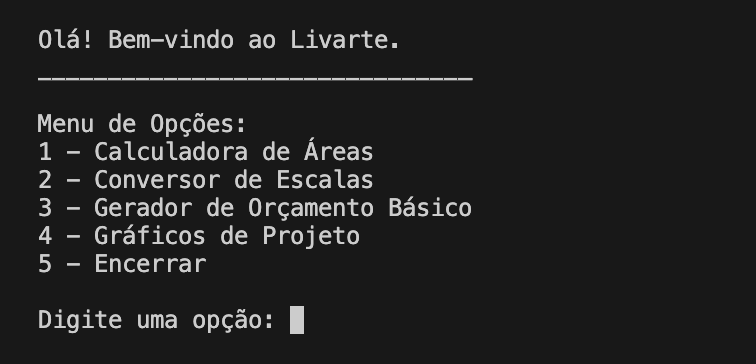
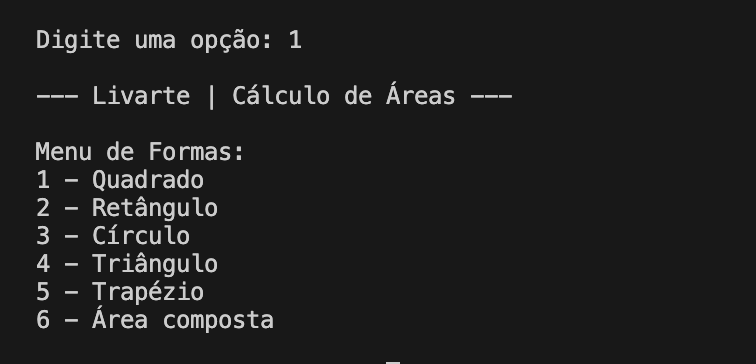
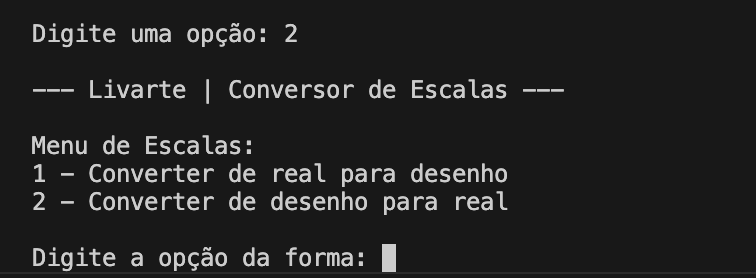
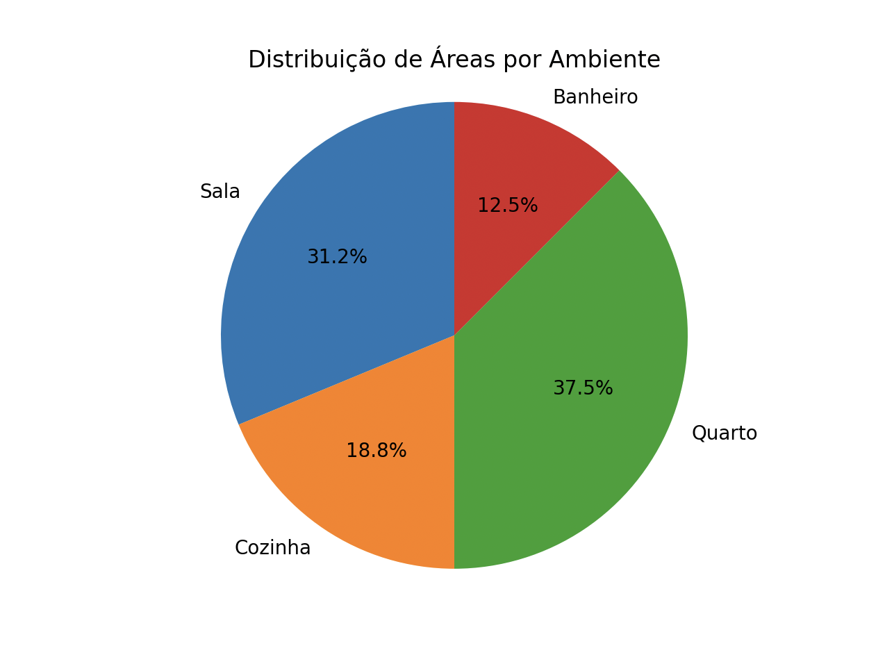
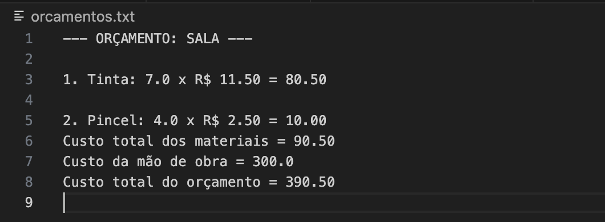

# LIVARTE 🏛️


O **Livarte** é uma aplicação em Python desenvolvida para **auxiliar e automatizar tarefas básicas** de profissionais das áreas de arquitetura e design de interiores, além de atender pessoas que estão reformando suas casas. A ferramenta oferece uma maneira *prática e acessível* de organizar custos e planejar **orçamentos**. Com ela, é possível **calcular áreas, converter escalas e construir gráficos** que facilitam o desenvolvimento do projeto. Os dados dos orçamentos são armazenados em um arquivo *.txt*, garantindo praticidade e fácil acesso às informações.

---

## Funcionalidades

1. **Calculadora de Áreas**
   - Cálculo preciso de áreas para diferentes formas geométricas: quadrado, retângulo, círculo, triângulo e trapézio.

2. **Conversor de Escalas**
   - Conversão prática entre escalas utilizadas em projetos arquitetônicos (real para desenho e desenho para real).

3. **Gerador de Orçamento Básico**
   - Registro e cálculo de materiais e mão de obra para orçamentos simples.

4. **Gráficos de Projeto**
   - Criação de gráficos de distribuição de áreas, orçamento por categoria e cronograma de obras.

5. **Armazenamento e Visualização de Orçamentos**
   - Salvamento em arquivos `.txt` e consulta de orçamentos anteriores.

6. **Tratamento de Erros e Validação de Entradas**
   - Validação das entradas do usuário para evitar dados incorretos.
   - Tratamento de arquivos inexistentes ou vazios para garantir estabilidade.

---

## Tecnologias Utilizadas

- **Linguagem**: Python 3
- **Bibliotecas**:
  - `math`: operações matemáticas essenciais, como cálculo de áreas.
  - `matplotlib.pyplot`: criação de gráficos claros e profissionais.
  - `matplotlib.dates`: manipulação e formatação de datas nos gráficos.
  - `datetime`: controle e manipulação de datas e horários.

---

## Como Usar

1. **Clone o repositório** na sua máquina local:
```bash
   git clone https://github.com/nibrito20/Livarte
   cd Livarte
```

2. **Crie e ative o ambiente virtual**:
```bash
   python3 -m venv .venv
   source .venv/bin/activate
```

3. **Instale as dependências**:
```bash
   pip install matplotlib
```

4. **Execute o programa**:
```bash
   python main.py
```

5. **Navegue pelo menu principal**, escolhendo entre as opções disponíveis e seguindo as instruções exibidas no terminal.

6. Para encerrar o programa de **forma segura**, digite `5` no menu principal.

---

## Interface e Navegação

Menu de navegação principal:


Tela da calculadora de áreas:


Tela do conversor de escalas:


Exemplo de gráfico gerado:


Exemplo da visualização do orçamento salvo:

